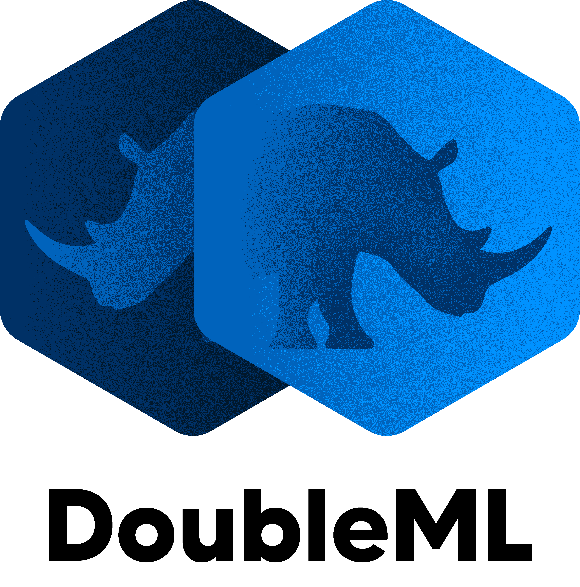

<!-- README.md is generated from README.Rmd. Please edit that file -->

# DoubleML - Double Machine Learning in R <a href="https://docs.doubleml.org"></a>

[](https://github.com/DoubleML/doubleml-for-r/actions?query=workflow%3Abuild)
[](https://app.codecov.io/gh/DoubleML/doubleml-for-r/)
[](https://www.codefactor.io/repository/github/doubleml/doubleml-for-r)
[](https://cran.r-project.org/package=DoubleML)

The R package **DoubleML** provides an implementation of the double /
debiased machine learning framework of [Chernozhukov et
al. (2018)](https://arxiv.org/abs/1608.00060). It is built on top of
[mlr3](https://mlr3.mlr-org.com/) and the [mlr3
ecosystem](https://github.com/mlr-org/mlr3/wiki/Extension-Packages)
(Lang et al., 2019).

Note that the R package was developed together with a python twin based
on [scikit-learn](https://scikit-learn.org/). The python package is also
available on [GitHub](https://github.com/DoubleML/doubleml-for-py) and
[](https://badge.fury.io/py/DoubleML).

## Documentation and maintenance

Documentation of functions in R:
<https://docs.doubleml.org/r/stable/reference/index.html>

User guide: <https://docs.doubleml.org>

**DoubleML** is currently maintained by
[`@PhilippBach`](https://github.com/PhilippBach) and
[`@SvenKlaassen`](https://github.com/SvenKlaassen).

## Main Features

Double / debiased machine learning framework of [Chernozhukov et
al. (2018)](https://arxiv.org/abs/1608.00060) for

- Partially linear regression models (PLR)
- Partially linear IV regression models (PLIV)
- Interactive regression models (IRM)
- Interactive IV regression models (IIVM)

The object-oriented implementation of **DoubleML** that is based on the
[R6 package for R](https://r6.r-lib.org/) is very flexible. The model
classes `DoubleMLPLR`, `DoubleMLPLIV`, `DoubleMLIRM` and `DoubleIIVM`
implement the estimation of the nuisance functions via machine learning
methods and the computation of the Neyman orthogonal score function. All
other functionalities are implemented in the abstract base class
`DoubleML`. In particular functionalities to estimate double machine
learning models and to perform statistical inference via the methods
`fit`, `bootstrap`, `confint`, `p_adjust` and `tune`. This
object-oriented implementation allows a high flexibility for the model
specification in terms of …

- … the machine learning methods for estimation of the nuisance
  functions,
- … the resampling schemes,
- … the double machine learning algorithm,
- … the Neyman orthogonal score functions,
- …

It further can be readily extended with regards to

- … new model classes that come with Neyman orthogonal score functions
  being linear in the target parameter,
- … alternative score functions via callables,
- … alternative resampling schemes,
- …

<figure>

<figcaption aria-hidden="true">OOP structure of the DoubleML
package</figcaption>
</figure>

## Installation

Install the latest release from CRAN:

``` r
remotes::packages("DoubleML")
```

Install the development version from GitHub:

``` r
remotes::install_github("DoubleML/doubleml-for-r")
```

**DoubleML** requires

- R (\>= 3.5.0)
- R6 (\>= 2.4.1)
- data.table (\>= 1.12.8)
- stats
- checkmate
- mlr3 (\>= 0.5.0)
- mlr3tuning (\>= 0.3.0)
- mlr3learners (\>= 0.3.0)
- mvtnorm
- utils
- clusterGeneration
- readstata13

## Contributing

DoubleML is a community effort. Everyone is welcome to contribute. To
get started for your first contribution we recommend reading our
[contributing
guidelines](https://github.com/DoubleML/doubleml-for-r/blob/main/CONTRIBUTING.md)
and our [code of
conduct](https://github.com/DoubleML/doubleml-for-r/blob/main/CODE_OF_CONDUCT.md).

## Citation

If you use the DoubleML package a citation is highly appreciated:

Bach, P., Chernozhukov, V., Kurz, M. S., and Spindler, M. (2021),
DoubleML - An Object-Oriented Implementation of Double Machine Learning
in R, arXiv:[2103.09603](https://arxiv.org/abs/2103.09603).

Bibtex-entry:

    @misc{DoubleML2020,
          title={{DoubleML} -- {A}n Object-Oriented Implementation of Double Machine Learning in {R}}, 
          author={P. Bach and V. Chernozhukov and M. S. Kurz and M. Spindler and Sven Klaassen},
          year={2024},
          journal={Journal of Statistical Software},
          volume={108},
          number={3},
          pages= {1-56},
          doi={10.18637/jss.v108.i03},
          note={arXiv:\href{https://arxiv.org/abs/2103.09603}{2103.09603} [stat.ML]}
    }

## Acknowledgements

Funding by the Deutsche Forschungsgemeinschaft (DFG, German Research
Foundation) is acknowledged – Project Number 431701914.

## References

- Bach, P., Chernozhukov, V., Kurz, M. S., Spindler, M. and Klaassen, S.
  (2024), DoubleML - An Object-Oriented Implementation of Double Machine
  Learning in R, Journal of Statistical Software, 108(3): 1-56,
  <doi:10.18637/jss.v108.i03>,
  arXiv:[2103.09603](https://arxiv.org/abs/2103.09603).

- Chernozhukov, V., Chetverikov, D., Demirer, M., Duflo, E., Hansen, C.,
  Newey, W. and Robins, J. (2018), Double/debiased machine learning for
  treatment and structural parameters. The Econometrics Journal, 21:
  C1-C68, <https://doi.org/10.1111/ectj.12097>.

- Lang, M., Binder, M., Richter, J., Schratz, P., Pfisterer, F., Coors,
  S., Au, Q., Casalicchio, G., Kotthoff, L., Bischl, B. (2019), mlr3: A
  modern object-oriented machine learing framework in R. Journal of Open
  Source Software, <https://doi.org/10.21105/joss.01903>.
